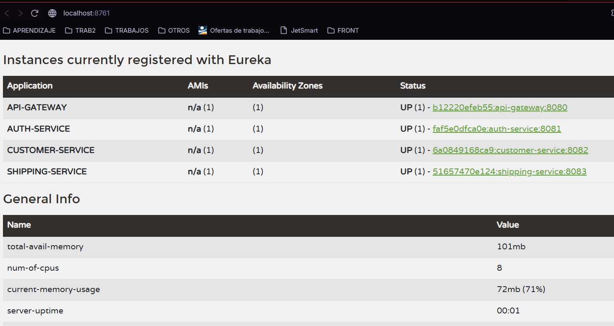

# ms-project-main

Repositorio multi-módulo de Spring Boot servicios de negocio para el envio de paquetes (`auth-service` , `customer-service` y `shipping-service`) y tres módulos de infraestructura de Spring Cloud (`eureka-server`, `config-server`, `api-gateway`).

Sistema aun esta en version local, cuenta con inicialización con docker (leer recomendaciones antes de levantar los servicios)

## Módulos

| Módulo             | Puerto | Descripción                                                                      | Estado            |
|--------------------|--------|----------------------------------------------------------------------------------|-------------------|
| `auth-service`     | 8081   | API REST de autentificación. Base de datos Postgres propia.                      | Implementado      |
| `customer-service` | 8082   | API REST de clientes registrados. consume el token generado por  `auth-service`. | Implementado      |
| `shipping-service` | 8083   | API REST de envios. Llama a `customer-service` vía OpenFeign.                    | Implementado      |
| `eureka-server`    | 8761   | Descubrimiento de servicios.                                                     | Solo andamiaje    |
| `config-server`    | 8888   | Configuración centralizada (Spring Cloud Config, perfil `native`).               | Solo andamiaje    |
| `api-gateway`      | 8080   | Gateway de borde (Spring Cloud Gateway).                                         | Solo andamiaje    |

Los servicios de negocio comparten:
*Justificación de persistencia:* Se utiliza PostgreSQL en cada servicio para asegurar el aislamiento de datos, garantizando la integridad referencial y transaccional necesaria para el dominio de envios.
- base de datos Postgres independiente por servicio
- APIs REST basadas en DTOs con validación de peticiones
- manejo global de excepciones
- logs de aplicación estructurados

Los módulos de infraestructura compilan y arrancan, pero los servicios de negocio aún no se registran en Eureka, no leen del Config Server y no pasan por el gateway.

## Arquitectura

Diagrama de cómo se conectan los dos servicios de negocio hoy:

```text
+-------------------------------------------------------------+
|                        Cliente HTTP                         |
|                       (curl / Postman)                      |
+------------------------------+------------------------------+
                               |
                               v
+-------------------------------------------------------------+
|                      API Gateway 8080                       |
+--------+---------------------+---------------------+--------+
         |                     |                     |
  /api/v1/auth          /api/v1/customers      /api/v1/shippings
         |                     |                     |
         v                     v                     v
+------------------+  +------------------+   +------------------+
| auth-service 8081|  | cust-service 8082|<--| ship-service 8083|
| AuthService      |  | CustomerService  |   | ShippingService  |
|                  |  |                  |   | FeignClient      |
+--------+---------+  +--------+---------+   +--------+---------+
         |                     |                      |
         v                     v                      v
+------------------+  +------------------+  +------------------+
| postgres-auth    |  | postgres-customer|  | postgres-shipping|
| 5432 auth_db     |  | 5433 customer_db |  | 5434 shipping_db |
+------------------+  +------------------+  +------------------+

Llamada interna:
-Auth Service: Gestiona la autenticación y emisión de tokens.
-Customer Service: Almacena la información de usuarios y clientes.
-Shipping Service: Orquesta la lógica de envíos. Utiliza Feign Client 
 para obtener datos de clientes desde el Customer Service de manera síncrona, 
 garantizando la consistencia durante la creación de guías de envío.

Persistencia: Cada microservicio gestiona su propia base de datos 
(Database-per-service pattern), asegurando el desacoplamiento de datos.
```

Flujo principal del ecosistema:
Al crear un envío (POST /api/v1/shippings): shipping-service valida la existencia del cliente llamando a customer-service vía OpenFeign.

Al confirmar los datos, calcula la tarifa, genera el envío y guarda en shipping_db datos del cliente (nombre, y la identidad al momento de la solicitud). 

Al realizar el registro, tambien actualiza la información en el historial por envios, junto con el usuario obtenido del token de autentificación


## Estructura del proyecto

```text
/ PROJECT
├── ms-config-repo/         
├── ms-project-main/
│   ├── auth-service/
│   ├── customer-service/
│   ├── shipping-service/
│   ├── gateway-service/
│   ├── eureka-server/
│   ├── config-server/
│   └── docker-compose.yml
└── README.md

authservice
├── application
│   └── services
│       └── impl
├── domain
│   ├── model
│   └── ports
│       ├── in
│       └── out
└── infrastructure
    ├── adapter
    ├── config
    ├── controller
    ├── dto
    │   ├── mapper
    │   ├── request
    │   └── response
    ├── exception
    ├── persistency
    │   ├── entity
    │   └── repository
    └── rest


customerservice
├── application
│   └── services
├── domain
│   ├── model
│   └── ports
│       ├── in
│       └── out
└── infrastructure
    ├── adapters
    │   └── client
    ├── config
    ├── controller
    ├── dto
    │   ├── request
    │   └── response
    ├── exception
    └── persistence
        ├── entity
        └── repository


shippingservice
├── application
│   └── service
├── domain
│   ├── model
│   └── ports
│       ├── in
│       └── out
└── infrastructure
    ├── adapter
    │   └── client
    ├── config
    │   └── client
    ├── controller
    ├── dto
    │   ├── request
    │   └── response
    ├── exception
    ├── mapper
    └── persistency
        └── entity
        └── repository
        
```
Todos servicios siguen una arquitectura hexagonal.

##### Estados y Transiciones del Paquete
*   **Estados:** REGISTRADO, EN_TRANSITO, EN_SUCURSAL, EN_RUTA_ENTREGA, ENTREGADO, REBOTADO, ELIMINADO.
*   **Transiciones:**
    *  REGISTRADO -> EN_TRANSITO;
    *  EN_TRANSITO -> EN_SUCURSAL;
    *  EN_SUCURSAL -> EN_RUTA_ENTREGA;
    *  EN_RUTA_ENTREGA -> ENTREGADO o REBOTADO;
    *  REBOTADO -> EN_TRANSITO;
    *  ENTREGADO -> no cambiante
    *  ELIMINADO -> no cambiante
    *   *Nota:* Cualquier otra transición lanzará una excepción `409 Conflict` con detalle descriptivo.


## Ejecutar localmente

Requisitos previos:

- Java 17
- Maven Wrapper incluido en cada módulo (`./mvnw`)
- Postgres disponible en `localhost:5432` (base `auth_db`), `localhost:5433` (base `customer_db`) y `localhost:5434` (base `shipping_db`).
- Modificar la ruta `server.git.uri` de config-server en application.yaml. Actualmente esta la ruta local de mi usuario
- La forma más simple es levantarlos con Docker Compose; ver [Ejecutar con Docker Compose](#ejecutar-con-docker-compose).

para levantar localmente, inicializar eureka server, config server y apigateway, porteriormente 
inicializar:
```bash
cd auth-service
./mvnw spring-boot:run
```

En otra terminal, levanta `customer-service`:

```bash
cd customer-service
./mvnw spring-boot:run
```

En otra terminal, levanta `shipping-service`:

```bash
cd shipping-service
./mvnw spring-boot:run
```

### Ejecutar con Docker Compose
Para levantar el stack completo (servicios + infraestructura):
```bash
docker compose --profile all up --build
```

## Dashboard Eureka



Puertos y bases de datos por defecto:

- `auth-service`: `8081`, Postgres en `localhost:5432`, base `auth_db`
- `customer-service`: `8082`, Postgres en `localhost:5433`, base `customer_db`
- `shipping-service`: `8083`, Postgres en `localhost:5434`, base `shipping_db`

`shipping-service` llama a `customer-service` mediante OpenFeign:

## Ejemplos de API

Autentificarse:

```bash
curl -X POST 'http://localhost:8080/api/v1/auth/login' \
  -h'Content-Type: application/json' \
  -d'{
    "email": "test1@example.com",
    "password": "Password123/"
}'
```

Respuesta de ejemplo:

```json
{
  "success": true,
  "message": "Login exitoso",
  "data": {
    "token": "eyJhbGciOiJIUzUxMiJ9.eyJvbGUiOiJBRE1JTiAwkuNiOXaAhkkSRrlE4-PFw",
    "email": "test1@example.com",
    "username": "TESTUSER",
    "role": "ADMIN"
  }
}
```

Crear un cliente:

```bash
curl -X POST 'http://localhost:8080/api/v1/customers' \
 -h 'Content-Type: application/json' \
 -h 'Authorization: Bearer [TOKEN]' \
 -d '{
  "dni": "75545528",
  "email": "test2@example.com",
  "phoneNumber": "+51999888777",
  "addresses": [
    {
      "street": "Av. Las Flores 123 - Dpto 402",
      "city": "Arequipa",
      "department": "Arequipa"
    }
  ]
}'
```

Respuesta de ejemplo:

```json
{
  "success": true,
  "message": "Customer registered successfully with multiple addresses",
  "data": {
    "id": "1bd16ad3-0053-4dca-b748-980435f54fb7",
    "dni": "75545528",
    "fullName": "GUERRERO NAUCA YORLIN",
    "email": "test2@example.com",
    "phoneNumber": "+51999888777",
    "addresses": [
      {
        "street": "Av. Las Flores 123 - Dpto 402",
        "city": "Arequipa",
        "department": "Arequipa"
      }
    ],
    "active": true,
    "createdAt": "2026-06-13T10:43:36.0803974",
    "updatedAt": "2026-06-13T10:43:36.0803974"
  }
}
```

Crear un envio:

```bash
curl 'http://localhost:8080/api/v1/shippings'
```

Si `customer-service` no está disponible al crear un envio, `shipping-service` devuelve una respuesta como `NO DISPONIBLE`.

## Ejecutar con Docker Compose

El archivo `docker-compose.yml` define dos perfiles para que arranques solo lo que necesites:

- `services`: Postgres más los dos servicios de negocio
- `all`: lo anterior más `eureka-server`, `config-server` y `api-gateway`

Levantar solo los servicios de negocio:

```bash
docker compose --profile services up --build
```

Levantar el stack completo, incluida la infraestructura:

```bash
docker compose --profile all up --build
```

Aviso: `docker compose up` sin perfil no arranca nada, porque todos los servicios están detrás de un perfil.

Contenedores y puertos en host:

- `postgres-auth` en `5432`
- `postgres-customer` en `5433`
- `postgres-shipping` en `5434`
- `auth-service` en `8081`
- `customer-service` en `8082`
- `shipping-service` en `8083`
- `eureka-server` en `8761` (perfil `all`)
- `config-server` en `8888` (perfil `all`)
- `api-gateway` en `8080` (perfil `all`)
- un volumen Postgres persistente por base de datos

## Configuración Dinámica (Hot-Reload)

El proyecto implementa **Spring Cloud Config** y **Actuator** para permitir la recarga de configuraciones de negocio en tiempo real, evitando tiempos de inactividad (Zero Downtime).

### Pasos para la demostración

Esta funcionalidad permite actualizar parámetros como `tarifa.base`, `tarifa.factor-peso` o `tarifa.insureance` sin reiniciar los contenedores:

1. **Verificar el valor actual:**
   Realiza una consulta a un envío para confirmar el costo calculado con la configuración vigente:
```bash
   curl -X GET http://localhost:8080/api/v1/shippings/{id}
```
(Observa el valor de shippingCost en el JSON de respuesta).

Modificamos el archivo shipping-service.yml en tu repositorio de configuración.

Actualiza los valores deseados (ej. tarifa.base: 20.0).

Ejecutamos la subida de cambios del archivo.

Ejecutar la recarga (Hot-Reload):
Dispara el endpoint de refresh para notificar al microservicio que debe refrescar sus beans marcados con @RefreshScope:
```bash
curl -X POST http://localhost:8083/actuator/refresh
```
Veremos que cambiado automáticamente con el nuevo valor configurado

si Realizamos un nuevo envió con datos similares al valor consultado este varía en el costo de envio.